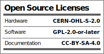

# M19 External Riser
External Riser for Olivetti M19

## Introduction

## Specifications
* Olivetti M19 External Riser (62 pin / card edge)
* 3 Slots
  * Note: Allows you to add 2 cards horizontally 
  * Example: XTIDE, 8bitd Ethernet Card , EMS Memory Card

## Hardware Documentation
**Attention** Pay attention to the insertion direction; the arrow indicates the back of the PC.

### Schematic and PCB Layout

[Schematic - Version 1.1](KiCad/M19_External_Riser_Schematics.pdf)

### Building Instructions

#### Assemble the PCB

* Clean the PCB with alcohol
* Solder j1 - j3 Connector
* Solder C1 - C6 Electrolytics capacitors
* Clean the remaining flux with alcohol

### Bill of Materials - Version 1.0

Component type     | Reference | Description                           | Quantity | Possible sources and notes 
------------------ | --------- | ------------------------------------- | -------- | --------------------------
PCB                |           | Riser PCB V1.0                        | 1        | Order from a PCB manufacturer of your choice using provided Gerber or KiCad files
BUS Connector 62p  | J1 - J3   | Connecteur de carte de bord, 62p      | 1        | https://fr.aliexpress.com/item/1005003647067417.html?spm=a2g0o.order_list.order_list_main.59.47d55e5bEbYVkg&gatewayAdapt=glo2fra
Capacitor          | C1 - C6   | 100µF / 25v Electrolytic Capacitor    | 4        | 

### Licensing

